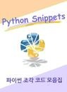

# Python Snippets

이 책은 실전에서 필요한 핵심 코드들만 짧게 모아놓은 조각 코드 모음집입니다.

코드에 대한 모음집과 간략한 팁 모음등으로 이루어져 있습니다.

- Book: [Python Snippets - 파이썬 조각 코드 모음](https://github.com/ubuntunux/Python-Snippets/blob/main/docs/README.md) 
- Email : ubuntunux@gmail.com
- Github: https://github.com/ubuntunux

### 들어가며

이 책은 내가 삽질해가며 얻은 꿀같은 경헙담이다.

이 책을 한번이라도 읽었다면 나와 같은 실수를 되풀이 하는 일은 없을것이다.

설령 당장 해결책이 떠오르지는 않더라도 이 책을 뒤져가며 어디선가 봤을 해결책을 찾아낼지도 모른다.

아주 어렵지도 쉽지도 않은 실전에 유용할 자료들을 모아서 많은 파이썬 유저들에게 배포해본다.

이 책에서는 절대로 내용을 깊게 파고 들어가지 않을 것이다. 사용자들이 어느정도의 수준을 갖추었다고 가정하고 최대한 빠르고 간편하게 응용할수 있는 정도로만 다룬다. 관심 있는 내용에 대해 자세히 알아보려면 따로 검색을 해보길 바란다.